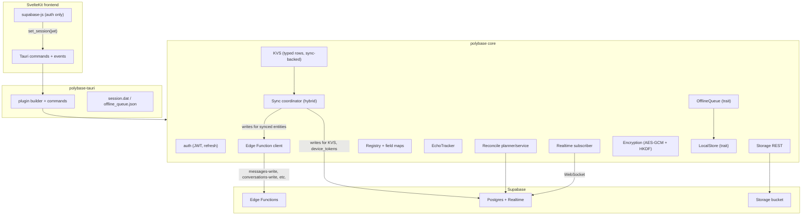

# PolyBase v2 (Rust) — foundation plan

## What we are building

A Cargo workspace at the root of [polykit-rust](/Users/danny/Developer/polykit-rust/) with three crates:

- `polylog` — the existing logger, lifted from `src/log/`. No API changes.
- `polybase` — platform-agnostic core: auth/refresh, typed Edge Function client, realtime subscriber, registry, hybrid sync engine, offline queue, storage, encryption, KVS, observable events. Pure Rust with abstract traits for local persistence and queue storage.
- `polybase-tauri` — thin Tauri 2 plugin: store-backed session persistence, offline-queue file storage, command surface (`edge_call`, `kvs_*`, `storage_*`, `encrypt`/`decrypt`, `bootstrap_sync`, etc.), event surface (`polybase:session-refreshed`, `polybase:realtime-changed`, `polybase:offline-queue-changed`).

A future `polybase-codegen` crate (TS bindings from a manifest) is left as room in the workspace, not built now.

## Architectural shape



Key fork: the **write path is hybrid**. Synced entities (messages/conversations/personas/attachments) go through Edge Functions; non-synced/admin entities (KVS, `device_tokens`) go through PostgREST with the user JWT. Reads, realtime, reconcile, storage, encryption all live in Rust regardless. Frontend keeps `supabase-js` only for the PKCE auth flow + session persistence; the JWT is then handed to Rust via `set_session` and Rust owns every subsequent HTTP call.

## Workspace layout

```
polykit-rust/
├── Cargo.toml                  # [workspace] + [workspace.dependencies]
├── rust-toolchain.toml         # unchanged
├── crates/
│   ├── polylog/                # current src/log/ moved here, public API unchanged
│   │   ├── Cargo.toml
│   │   └── src/
│   ├── polybase/
│   │   ├── Cargo.toml
│   │   └── src/
│   │       ├── lib.rs
│   │       ├── client.rs           # SupabaseClient (reqwest) + headers + retry
│   │       ├── auth/               # JWT, refresh loop, observable AuthState
│   │       ├── edge/               # typed Edge Function client, idempotency keys, error decode
│   │       ├── realtime/           # Phoenix WebSocket transport + Subscriber
│   │       ├── storage/            # bucket REST adapter
│   │       ├── encryption/         # AES-GCM + HKDF, "enc:" prefix, binary magic header
│   │       ├── registry/           # EntityConfig, FieldMapping, ParentRelation, ConflictRules
│   │       ├── sync/
│   │       │   ├── coordinator.rs  # persist_change / persist_new / delete (hybrid dispatch)
│   │       │   ├── push.rs         # PostgREST push (non-synced) + tombstone UPDATE
│   │       │   ├── pull.rs         # bulk select, version probe, merge
│   │       │   ├── echo.rs         # EchoTracker (5s default)
│   │       │   ├── reconcile.rs    # planner + service
│   │       │   └── reducer.rs      # offline backoff state machine (port of Sync/Core.swift)
│   │       ├── offline_queue/      # OfflineQueue trait + dedupe + finalize-safe replay
│   │       ├── kvs/                # typed KV rows on top of sync engine
│   │       ├── persistence/        # LocalStore trait (read/write/upsert/version probe)
│   │       ├── events.rs           # tokio::sync::broadcast for sync/auth/realtime signals
│   │       └── errors.rs           # PolyError, PushError, PullError, EdgeError
│   ├── polybase-tauri/
│   │   ├── Cargo.toml
│   │   └── src/
│   │       ├── lib.rs              # tauri::plugin::Builder
│   │       ├── commands.rs         # set_session, clear_session, edge_call, kvs_*, storage_*, encrypt/decrypt, bootstrap_sync, refresh_sync, configure_core
│   │       ├── events.rs           # emit polybase:* events to JS
│   │       ├── session_store.rs    # tauri-plugin-store backed session.dat
│   │       └── queue_store.rs      # file-backed OfflineQueue impl
│   └── polybase-sqlite/            # optional: shipped LocalStore impl over sqlx (extract from Tauri Prism)
│       └── ...
└── examples/
    └── tauri-minimal/              # smallest possible Tauri 2 app wiring polybase-tauri
```

## Concrete design choices to lock in now

### Edge Function client

Mirror the contract already established in [supabase/functions/_shared/mutation/](/Users/danny/Developer/Prism/Tauri/supabase/functions/_shared/mutation/). Typed `EdgeRequest<T>` carries:

- `function_name` (`messages-write`)
- `op` (`/v1/send`, `/v1/edit`, etc.)
- `idempotency_key` (auto-generated UUIDv7, recorded in `mutation_idempotency`)
- `payload: T: Serialize`
- `request_id` for log correlation

Response decoded into `EdgeResponse<R>` matching `{ success, data | error: { code, message }, request_id }`. Errors classified into `EdgeError::Validation`, `Conflict`, `Forbidden`, `Transient`, `Permanent` so the offline queue replay knows what to retry vs drop. Built on the same permanent-vs-transient classification logic from [SyncCoordinator.swift](/Users/danny/Developer/polykit-swift/PolyBase/Sync/SyncCoordinator.swift).

### Sync coordinator dispatch

`Coordinator::persist_change(entity)` reads the registry to decide:

- If `EntityConfig.write_path == WritePath::Edge { function, op_for }` → build payload via field map → call `Edge::call(...)` with auto-generated idempotency key → mark echo before await → on permanent error, drop; on transient, enqueue.
- If `EntityConfig.write_path == WritePath::PostgREST { table }` → existing PostgREST upsert path (used for KVS, `device_tokens`, future admin tables).

This preserves all 13 hard-won lessons from Swift PolyBase (echo-mark-before-push, tombstone UPDATE, +1000 undelete delta, permanent-error classification, queue finalize race safety, build-record-before-async) — just with two write transports instead of one.

### Realtime transport

Define a `RealtimeTransport` trait so we can swap implementations. Day 1 implementation lifts the hand-rolled Phoenix WebSocket from [src-tauri/src/realtime/mod.rs](/Users/danny/Developer/Prism/Tauri/src-tauri/src/realtime/mod.rs) and cleans it up into `polybase::realtime::transport::PhoenixTransport`. We can evaluate `realtime-rs` later without API churn.

### Encryption

Bit-for-bit cross-compatible with [PolyBase/Encryption.swift](/Users/danny/Developer/polykit-swift/PolyBase/Encryption.swift): AES-GCM + HKDF per-user, `enc:` prefix for strings, binary magic header for blobs. Same shared secret env var (we standardize on `POLYBASE_ENCRYPTION_SECRET`; Tauri Prism's `VITE_PRISM_APP_SECRET` and Edge `PRISM_ENCRYPTION_SECRET` both point at it). Required for Swift app and Tauri app to read each other's encrypted columns.

### KVS layer

Single new table:

```sql
create table public.kvs (
  user_id    uuid not null references auth.users(id) on delete cascade,
  namespace  text not null,
  key        text not null,
  value      jsonb not null,
  version    bigint not null default 0,
  deleted    boolean not null default false,
  updated_at timestamptz not null default now(),
  primary key (user_id, namespace, key)
);
-- RLS: user can read/write their own rows; realtime publication enabled
```

Registered in `polybase::registry` like any other entity, so it gets versioning, tombstones, echo suppression, and realtime fan-out for free. Public API: `Kvs::get<T>(namespace, key)`, `Kvs::set(namespace, key, value)`, `Kvs::delete(namespace, key)`, `Kvs::subscribe(namespace)` returning a `tokio::sync::broadcast::Receiver`. Replaces the iCloud-KVS callsites in Swift Prism: model defaults, streaming policy, sidebar `expandedPersonaIDs`, Lumen nodes, custom servers, persona companion retention.

### LocalStore trait

`polybase` does not depend on sqlx directly. It defines:

```rust
#[async_trait]
pub trait LocalStore: Send + Sync {
    async fn read_versions(&self, table: &str, ids: &[String]) -> Result<Vec<VersionRow>>;
    async fn upsert_record(&self, table: &str, record: Record) -> Result<()>;
    async fn read_record(&self, table: &str, id: &str) -> Result<Option<Record>>;
    async fn read_all_ids(&self, table: &str) -> Result<Vec<String>>;
    async fn mark_deleted(&self, table: &str, id: &str, version: i64) -> Result<()>;
}
```

`polybase-sqlite` provides a default implementation extracted from [src-tauri/src/db/](/Users/danny/Developer/Prism/Tauri/src-tauri/src/) and the per-user switching from [src-tauri/src/auth/mod.rs](/Users/danny/Developer/Prism/Tauri/src-tauri/src/auth/mod.rs). Future Tauri apps can ship their own `LocalStore` (or use no local mirror at all) without touching `polybase`.

### OfflineQueue trait

Same pattern: `polybase` defines the trait + the dedupe/replay state machine; `polybase-tauri::queue_store` provides a JSON-file implementation matching the current `offline_queue.json` shape. Reducer logic ported from [PolyBase/Sync/Core.swift](/Users/danny/Developer/polykit-swift/PolyBase/Sync/Core.swift) (250 ms debounce, 2 s reconnect, backoff ladder up to 120 s, 20 s per-operation timeout). Disabled in tests via environment detection (Swift uses `PolyProcess.isRunningInDevEnvironment()`; Rust will use `cfg!(test)` plus `POLYBASE_DISABLE_OFFLINE_QUEUE` env override).

### Tauri command surface

`polybase-tauri` exposes one cohesive surface — Tauri Prism currently has ~30 ad-hoc commands across `bridge`, `sync`, `storage`, `auth`, `realtime`. We replace them with:

| Command | Purpose |
| --- | --- |
| `polybase_configure` | URL, anon key, encryption secret, bucket |
| `polybase_set_session` / `polybase_clear_session` | Session handoff from supabase-js |
| `polybase_edge_call` | Generic typed Edge Function call (frontend or Rust callers) |
| `polybase_kvs_get` / `_set` / `_delete` / `_subscribe` | KVS surface |
| `polybase_storage_upload` / `_download` / `_delete` | Storage surface |
| `polybase_encrypt` / `_decrypt` | String/blob encryption helpers |
| `polybase_bootstrap_sync` / `_refresh_sync` | Trigger initial pull / convergence |
| `polybase_apply_remote_records` | Optimistic ack path (matches today's pattern) |

Tauri Prism's app-specific commands (`list_personas`, `list_messages_page`, etc.) stay in `src-tauri/src/lib.rs` since they are app-domain queries against the local store, not generic library surface.

## Migration sequencing for Tauri Prism

We do not rewrite Tauri Prism in one shot. Instead:

1. Stand up the workspace + move the logger.
2. Build `polybase` with auth, edge, encryption, storage, errors, events. Get unit tests green.
3. Extract sync engine bones: registry, echo, push (PostgREST path only at first), pull, reconcile, reducer, offline queue. Lift code from `src-tauri/src/sync/` and `src-tauri/src/registry/` rather than rewriting from scratch — they are good and battle-tested in their own right.
4. Add the Edge write-path branch in the coordinator. Wire `EntityConfig::write_path` and route `messages`/`conversations`/`personas`/`attachments` to `messages-write`/etc.
5. Add KVS module, ship migration `0004_kvs.sql` for both [supabase/migrations/](/Users/danny/Developer/Prism/Tauri/supabase/migrations/) and [src-tauri/migrations/](/Users/danny/Developer/Prism/Tauri/src-tauri/migrations/).
6. Stand up `polybase-tauri` with the plugin + commands + events.
7. Build `polybase-sqlite` from Tauri Prism's `db/` module.
8. Cut Tauri Prism's `src-tauri/src/lib.rs` over to use `polybase-tauri`. Old commands become thin shims that delegate. Frontend [src/lib/prism.ts](/Users/danny/Developer/Prism/Tauri/src/lib/prism.ts) stops calling Edge Functions via `fetch` and routes through `polybase_edge_call`.
9. Reconcile the [RLS lockdown migration](/Users/danny/Developer/Prism/Tauri/supabase/migrations/20250730000002_lockdown_rls.sql) with the new write paths — every synced-entity write now legitimately uses the service-role-protected Edge Functions, so the lockdown becomes correct rather than an unresolved tension.
10. Migrate Swift Prism's iCloud-KVS callsites to use the same `kvs` table via PolyBase Swift v2 (handled separately, not in this plan).

## Out of scope for this plan

- Apple Sign In support (current Tauri uses email/password; revisit if needed).
- Push notification / device-token registration as a polybase module — design only, no implementation. Will live in `polybase::notifications` later, modeled on Swift's [DeviceTokenService.swift](/Users/danny/Developer/Prism/Prism/Services/Platform/DeviceTokenService.swift).
- TS bindings codegen (`polybase-codegen`).
- PolyLog remote ingest port (the Swift [PolyBase/Log/Remote.swift](/Users/danny/Developer/polykit-swift/PolyBase/Log/Remote.swift) module). Defer until we want centralized log streaming from Tauri.
- Any change to Swift PolyBase v1 — it keeps working as-is until we are ready to converge it onto the new Edge-first contract.

## Open items to confirm during implementation

- Whether `polybase-sqlite` lives in this workspace or moves to its own repo eventually (probably stays here for now).
- Whether to adopt `realtime-rs` once the trait is in place (decide after first integration test against live Supabase).
- Exact env var name (`POLYBASE_ENCRYPTION_SECRET` vs preserving the current dual `VITE_PRISM_APP_SECRET` / `PRISM_ENCRYPTION_SECRET` names for migration friendliness).
